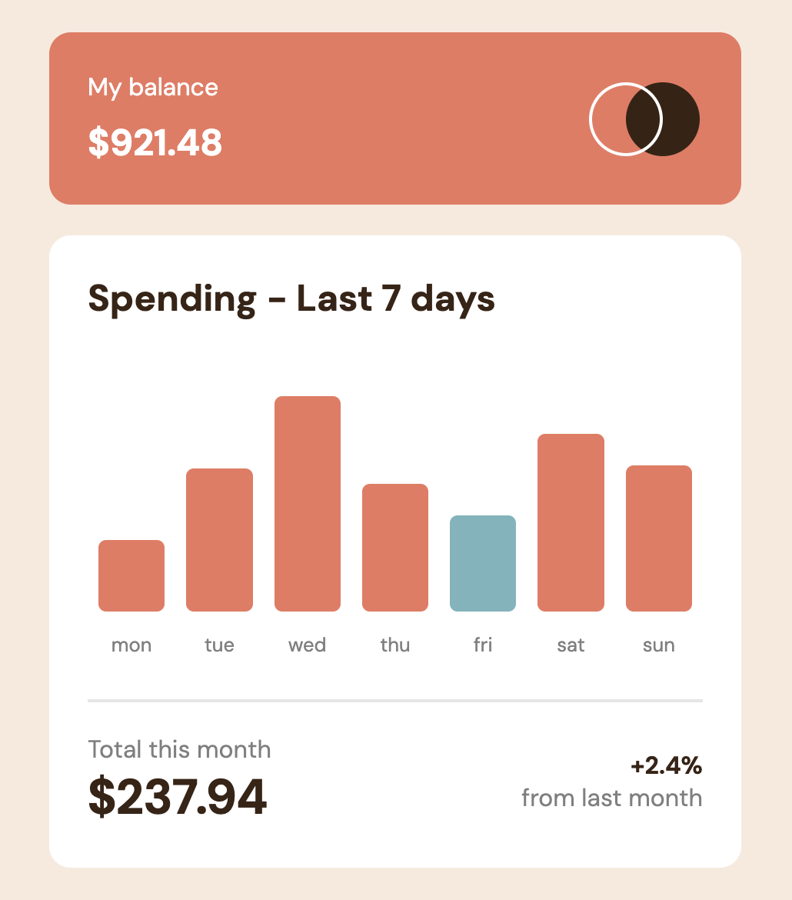

# Frontend Mentor - Expenses chart component solution

This is a solution to the [Expenses chart component challenge on Frontend Mentor](https://www.frontendmentor.io/challenges/expenses-chart-component-e7yJBUdjwt). Frontend Mentor challenges help you improve your coding skills by building realistic projects.

## Table of contents

- [Overview](#overview)
  - [The challenge](#the-challenge)
  - [Screenshot](#screenshot)
  - [Links](#links)
- [My process](#my-process)
  - [Built with](#built-with)
  - [What I learned](#what-i-learned)
  - [Continued development](#continued-development)
- [Author](#author)

## Overview

To work on my vanilla CSS, HTML, and JavaScript skills, I decided to do this Frontend Mentor challenge. I matched the design specifications visually and functionally (but there is no memory of previous months associated with it at the present). At some point I plan on taking this base and expanding it into a functional system for myself in my actual banking.

### The challenge

Users should be able to:

- View the bar chart and hover over the individual bars to see the correct amounts for each day
- See the current day’s bar highlighted in a different colour to the other bars
- View the optimal layout for the content depending on their device’s screen size
- See hover states for all interactive elements on the page
- **Bonus**: Use the JSON data file provided to dynamically size the bars on the chart

### Screenshot

### Links

- Live Site URL: [https://sweetcaroline36.github.io/ExpenseChart-Challenge/](https://sweetcaroline36.github.io/ExpenseChart-Challenge/)

## My process

I built the website out with HTML and CSS before dealing with the live updating bars. I couldn't figure out how to reference the JSON data directly from the file, so during development I created a variable within the JS that held all that data. The math wasn't bad; I just made each bar's height a percentage of that day's spending out of the highest spender. That could perhaps be misleading week to week as overall costs are greater or smaller, but for the purposes of the challenge it works. I built the site mobile-first. Right now the JSON file doesn't do anything, as I had trouble referencing the data separately. I plan on returning to that, and in the meantime the data exists in a JS variable.

### Built with

- Semantic HTML5 markup
- CSS custom properties
- JavaScript
- Flexbox
- CSS Grid
- Mobile-first workflow

### What I learned

It was great practice for vanilla CSS (I'll probably learn Tailwild at some point)! The main thing that tripped me up for a while was the hover effects. It was easy for most of the bars, but I found that I couldn't use hover effects the same way for the bar that was being styled via JS (the blue bar of the current day). I still need to learn about the intricacies of styling via JS and when/how it can be overridden in CSS.

### Continued development

I want to work on expanding an idea like this into a full-scale application. I plan on continuing development beyond the design specifications of the challenge, perhaps as a new repo. I want to get comfy with using JSON data files and eventually hooking up to servers, utilizing data security and privacy techniques, and creating a UI to see the data in multiple contexts.

## Author

- Frontend Mentor - [@SweetCaroline36](https://www.frontendmentor.io/profile/SweetCaroline36)
- Instagram - [@caroline.a.conner](https://www.instagram.com/caroline.a.conner/)
